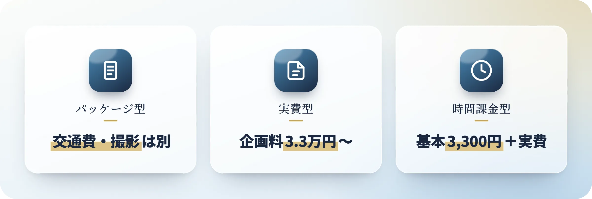
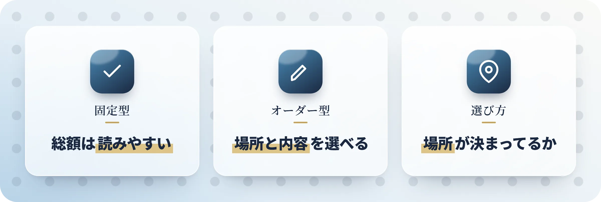
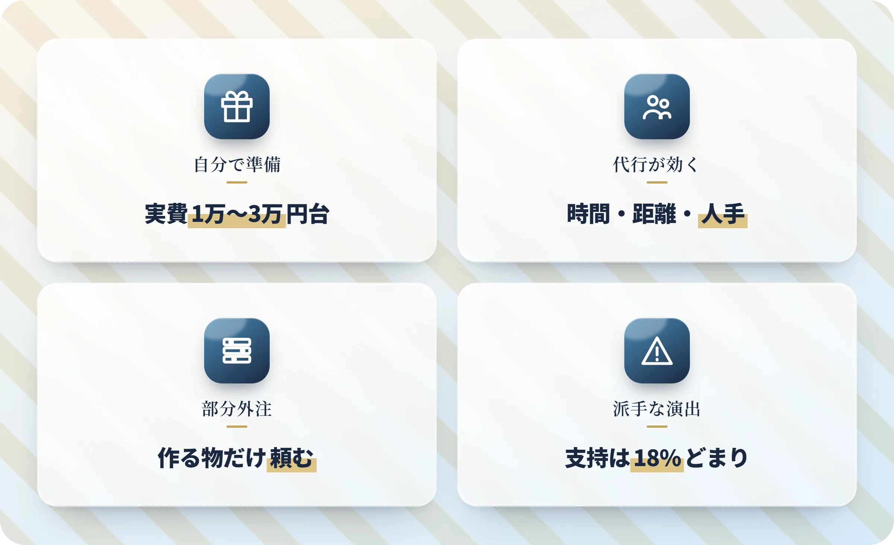
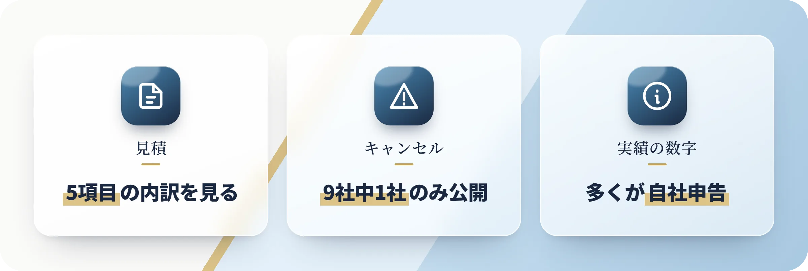

記念日までもう時間がないのに準備が進まない、サプライズ代行サービスを比較したくても料金が出てこない、そもそもどんな会社があるのか分からない――こうした状況で手が止まっている方は多いのではないでしょうか。

「人に頼むのは手抜きなんじゃないか」と気が引ける方もいるかもしれません。ただ、仕事や距離の事情で準備の時間が取れないまま当日が近づくことは、よくあります。本記事では、6タイプ別の料金相場と、依頼前に見ておきたい見積・キャンセル規定を2026年8月時点の公開情報から整理しました。

:::summary
- サプライズ代行は6タイプ。公開価格は2,000円〜50万円まで開く
- 表示価格は基本料金。交通費・会場費・飲食代は別にかかる
- 自分で準備なら実費1万〜3万円台。代行は時間・距離・人手が理由なら効く
- 料金とキャンセル規定を両方公開していたのは、調べた9社中1社
- 派手な演出は不人気。フラッシュモブへの女性の支持は18%（2023年調査）
:::

[[toc]]

## サプライズ代行サービスの6タイプと料金相場

同じ「サプライズ代行」でも、演出をまるごと請け負う会社もあれば、当日の設営だけ手伝う便利屋もあります。2026年8月時点で公開価格を並べると、2,000円から50万円まで開きがありました。

| タイプ | 公開価格 | 頼める範囲 | 向いている人 |
|---|---|---|---|
| 演出パッケージ型 | 14万〜44万円 | ダンサー・撮影の一式 | 演出を丸ごと任せたい方 |
| プロデュース料＋実費型 | 4千円〜50万円＋実費 | 企画・手配・当日の進行 | 内容から相談したい方 |
| 会場紐付けプラン型 | 5.5万〜8.3万円＋飲食代 | 決まった会場での演出 | 総額を先に決めたい方 |
| 時間課金・便利屋型 | 1.5万円〜（2時間から） | 買い出し・設営・人手 | 作業だけ頼みたい方 |
| トータル記念日型 | 5.5万〜7.7万円 | 花と席の手配・当日の演出 | 地元で一通り任せたい方 |
| スポット外注型 | 2千円〜3万円 | 動画やイラスト制作 | 自分で組み立てる方 |

任せる範囲が変われば、総額の桁ごと変わります。==g:まず「どこまで任せたいか」を決めてから業者を見る==と、比べる相手が絞れてきます。

## サプライズ代行の料金は基本料金と実費で決まる

見積を見て驚くのは、表示価格が総額ではないからです。料金の決まり方を3つに分けます。

### 演出パッケージ型｜交通費と撮影は別料金

フラッシュモブなど大がかりな演出を一式で請け負うタイプです。[サプライズモール](https://surprise-mall.jp/price/)のメモリプレイ ライトは218,000円（税込239,800円）で、ここに別料金が乗ります。

:::box color=#e74c3c label="基本料金に含まれない主な費用"
- 交通費：30,000円〜が別途
- 撮影パック：143,000円（税込・カメラマン3名。DVDは1〜2か月後）
- ピンマイク：44,000円（税込）
:::

撮影パックを付けると、交通費を除いて==p:税込382,800円==です。オプションを足した後の金額で比べてみてください。

### プロデュース料＋実費型｜会場費と飲食代は自己負担

企画と手配を請け負い、実費は依頼した本人が払うタイプです。[プロポーズラボ](https://propose-lab.com/lp/)はプロデュース料33,000円（税込）〜で、会場費やコース料金、部屋のグレード代は自己負担です。

- **[サプライザー](https://surpriser.jp/)**：企画の提案だけなら3,980円、紹介と手配サポート込みで88,800円、スタッフ派遣と当日の進行まで498,000円（交通費別）。各60名限定の2026年特別価格です
- **ユニークガール**：先に企画料を払い、企画が固まってから飲食や外注の実費を追加で請求される2段階の課金。企画料の金額は公式ページで確認できませんでした

業者に払うお金と会場に直接払うお金を分けて見ると、総額がつかめます。

### 時間課金型｜基本料金＋出張費＋作業時間

作業した時間で計算するタイプです。[ワンストップ代行センター（東京便利屋）](https://tokyobenriya.com/price)なら、プレゼントの購入代行やレストラン・ホテルの手配だけを頼むこともできます。リムジンや映画館の貸切、旅行やチケットの手配も同じ仕組みです。

| 項目 | 金額（税込） |
|---|---|
| 基本料金 | 3,300円（依頼1件） |
| 出張費 | 都心14区は一律3,300円、大田・練馬・板橋など周辺の区は4,400円。メールと電話のみは不要 |
| 作業料（1名1時間） | Bランク4,180円、Aランク5,280円、Sランク6,380円、SSランク12,980円 |

Bランクを2時間頼むと、基本料金と出張費込みで14,960円です（都心14区）。作業は最低2時間からの依頼もあります。

## プラン固定型とオーダーメイド型の選び方

ここで迷いやすいのが、決まったプランから選ぶか、内容を一から組んでもらうかです。

### プラン固定型｜総額は読みやすいが場所を選べない

会場と内容がセットになった、表でいう会場紐付けプラン型です。[アニヴェルセルのプロポーズプランナー](https://propose.anniversaire.co.jp/)は、ディナープラン82,500円、スペシャルプラン55,000円で、自社のチャペルや会場で実施します。

:::box color=#3498db label="プラン固定型の特徴"
- 金額が公開されていて、申し込む前に総額を計算できる
- 会場は自社施設。思い出の店や旅行先では使えない
- 演出の内容もプランの範囲に収まる
:::

場所にこだわりがなく、金額を先に確定させたい方に向いています。

### オーダーメイド型｜場所と内容を決められる

会場も演出も一から決めていくタイプです。[&more](https://andmore112.com/features/)は会場の縛りがない完全オーダーメイドを掲げ、レストラン予約から撮影許可の申請、装飾の設営まで引き受けます。同じオーダーメイドでも、料金の見せ方は会社によって違います。

:::box color=#3498db label="料金の見え方の違い"
- &more：料金は非公開で、相談してから見積が出る（全国対応・LINE相談は無制限）
- [アミティエノリ](https://amitie-nori.net/produce)（静岡）：花の手配、提携レストランの席取り、提携先との交渉と事前決済まで含めて55,000〜77,000円（税込）
:::

==場所を自由に選べるほど、総額は見積を取るまで読めなくなります==。その代わり、思い出の店や旅行先など、渡したい場所をそのまま使えます。

### 場所と予算で決まる向き不向き

どちらが向くかは、場所を先に決めているか、総額を先に確定させたいかで分かれます。

| 状況 | 向いているタイプ |
|---|---|
| 場所にこだわりがない | プラン固定型 |
| 渡す場所や店がすでに決まっている | オーダーメイド型 |
| 総額を先に確定させたい | プラン固定型 |
| 持ち込みたい演出や思い出の品がある | オーダーメイド型 |
| 相手との関係や好みに合わせて内容を変えたい | オーダーメイド型 |

用意されたプランで気持ちが動くなら、プラン固定型のほうが決めるのは早いです。相手の好みや二人の予算に合わせて中身を組み替えたいなら、オーダーメイド型を軸に探します。

## サプライズ代行が向くケースと自分で準備する場合

「人に頼むほどのことかな」と迷うところなので、まず自分でやる場合の金額から見ていきます。

### 自分で準備する場合の実費は1万〜3万円台

まず、自分で用意した場合の金額です。ギフト情報サイトAnnyの[ホテルサプライズの解説](https://anny.gift/oiwai-contents/guides/general/hotel-surprise-howto/)に、品目ごとの相場が出ています。

:::box color=#1a2840 label="自分で準備する場合の実費"
- 花束：3,000〜10,000円
- ケーキ：3,000〜8,000円
- バルーン装飾：5,000〜15,000円
- レストランの予約：自分で取れば0円
:::

合計すると1万〜3万円台に収まります。外部の飲食物の持ち込みを断るホテルもあるので、ケーキを持ち込む予定なら先に電話で聞いておきましょう。

### 代行が効くのは時間・距離・当日の人手が問題のとき

自分で準備すれば1万〜3万円台です。代行に手配や進行まで任せると、プロデュース料が33,000円（税込）〜上乗せされます。この差を払う理由があるかどうかで分かれます。

:::box color=#1a2840 label="代行を頼む理由がはっきりする場面"
- 仕事や移動が詰まっていて、店やギフトを探す時間が取れない
- 遠距離で、現地の会場や花屋を自分では手配できない
- 当日は相手と一緒にいるため、設営や進行を任せたい
- 装飾や搬入など、一人では回らない人手が要る
:::

逆に、時間もあって近場で完結するなら、自分で組んだほうが安く収まります。

### 全部を任せない「部分外注」という選び方

全部を頼むか、全部自分でやるかの2択ではありません。作りたいものだけを[ココナラ](https://coconala.com/search?keyword=サプライズ)のようなスキルマーケットに出す方法もあります。

| 出品例 | 実勢価格 |
|---|---|
| サプライズムービー | 12,000円 |
| メモリアルムービー | 23,000円 |
| パラパラ漫画のサプライズムービー | 28,000〜30,000円 |
| ケーキ用のオーダー似顔絵 | 2,000円 |
| 似顔絵入りの席次表 | 7,000円 |

ココナラやランサーズに出ているのは==p:制作物の部分外注が中心==で、企画ごと任せる出品は多くありません。店の予約は自分で取り、動画だけ外注し、当日の設営だけ便利屋に頼む——この組み方もできます。

### 派手な演出は代行に向かない｜調査では支持18%

大がかりな演出そのものが喜ばれるとは限りません。みんなのウェディングの[2023年プロポーズに関するアンケート](https://www.mwed.jp/articles/12162/)（n=390、調査期間2023年2月24日〜3月2日）に、はっきりした差が出ています。

:::box color=#e74c3c label="2023年プロポーズに関するアンケート（n=390）"
- フラッシュモブ・プロポーズを支持した女性は18%
- 人が多い公共の場でのプロポーズも約7割が否定的
- 一方、プロポーズにサプライズ要素があること自体は約88%が支持
:::

:::info
フラッシュモブの手配業者を紹介するガイドでは、「直近3か月以内に動画の投稿がない業者は稼働停止の疑い」が選び方の基準に挙げられています。業者の入れ替わりが起きている分野です。
:::

喜ばれているのはサプライズがあること自体で、人前での派手さではありません。外注するなら、演出の規模より当日の段取りを任せるほうが、満足につながりやすいです。

## サプライズ代行の依頼から当日までの流れと日数

依頼から当日までの流れは、会社が違っても大きくは変わりません。初めてだと想像がつかないところなので、アミティエノリの公開手順をもとに並べました。工程の名前は会社ごとに変わります。

:::timeline title=依頼から当日までの流れ
### 問い合わせ・相談
フォームやLINEで連絡します。調べた10社のうち8社が相談無料と明記していました。

### ヒアリング
日付、相手との関係、渡したい場所、予算、やりたい演出を伝えます。

### プラン提案・見積
見積が出たら、基本料金と実費の内訳を確認します。

### 契約・支払い
企画料は先払い、実費は後払いに分ける会社もあります。

### 会場・業者の手配
レストランや花、カメラマンの手配が進みます。事前決済まで代行する会社もあります。

### 当日の実施
スタッフが現地に入る場合は、当日の進行も任せられます。
:::

:::box color=#e74c3c label="間に合わなくなるのは業者より会場の予約"
- 記念日ディナーの予約：通常3週間〜1か月前。人気店や夜景の店、ホテルダイニングは==p:2か月前==（[Annyの記念日ディナーガイド](https://anny.gift/oiwai-contents/guides/date/anniversary-dinner/)）
- ホテルへのサプライズ依頼：2週間前まで、遅くとも1週間前
- 代行側は最短1日前の申し込みに応じる会社もある（プロポーズラボ）
:::

相手にバレない段取りも、依頼と同時に決めておくと安心です。連絡手段、カード明細に出る業者名、荷物の受け取り先——この3つは最初に確認しておきましょう。

## 代行業者の選び方｜見積とキャンセル規定の確認点

代行選びでつまずきやすいのは、料金より契約まわりです。見積・キャンセル規定・実績の3点を見ます。

### 見積は基本料金と実費の内訳で確認する

見積は総額だけ見ても比べられません。同じ50,000円でも、含まれる範囲が会社ごとに違うためです。

:::box color=#3498db label="見積で確認する5項目"
- どこまでが基本料金に含まれるか
- 交通費・出張費は基本料金に入っているか
- 会場費・飲食・花・ケーキの実費は誰が払うか
- 当日入るスタッフの人数と拘束時間
- 撮影は別料金か。別なら何名でいくらか
:::

そもそも料金を公開している会社は、今回調べた範囲で10社中4社でした。総額は見積を取ってから分かるものと考えて、同じ条件で2〜3社に聞いてみてください。

### キャンセル規定と特商法表記を契約前に見る

キャンセル規定は、料金よりさらに公開されていません。2026年8月時点で9社を調べたところ、料金とキャンセル規定を両方出していたのは1社だけでした。ワンストップ代行センター（東京便利屋）です。

:::box color=#e74c3c label="2026年8月時点の公開状況"
- ワンストップ代行センター：3日前までに連絡。当日100%・前日70%・2日前50%
- サプライズモール：料金は全公開。キャンセル規定は公式サイト上で確認できず
- サプライザー：特定商取引法に関する表記のページが見つからず（/law・/tokushoho とも404）
:::

[国民生活センター](https://www.kokusen.go.jp/soudan_now/data/coolingoff.html)によると、自分から申し込んだ役務の契約は原則クーリング・オフの対象外です。途中でやめたくなったときの条件は、==契約書のキャンセル条項==で決まります。

### 実績の数字は自社申告かどうかで見る

「700組超」「累計300件以上」「都内300会場の実績」といった数字は、いずれも各社が自社サイトで掲げているものです。第三者が検証した数字ではありません。

:::box color=#3498db label="実績数より確認したいこと"
- 事例の中身（どこで、何を、いくらで実施したか）が公開されているか
- 料金の内訳が事例と紐づいているか
- サイトの管理状態（表記の更新、証明書の期限、リンク切れ）
:::

2026年8月時点では、SSL証明書が期限切れのまま公開されている業者もありました。実績の数より、確認できる情報がそろっているかで見るほうが確実です。

:::box label="無料相談・お問い合わせ"
どのタイプが合いそうか決めきれないときは、[お問い合わせフォーム](https://anniv.gift/contact)から無料でご相談いただけます。予算や希望が固まっていない段階のご相談も受け付けています。
:::

## まとめ｜サプライズ代行は任せる範囲で料金が決まる

サプライズ代行の料金は、業者の格ではなく==g:任せる範囲==で決まります。どこまで頼みたいかが決まると、見るべき会社は自然に絞れます。

:::box color=#1a2840 label="この記事の要点"
- 2千円〜3万円：動画やイラストなど制作物だけを外注する
- 1.5万円〜：時間課金の便利屋型で、当日の設営や人手を頼む
- 5.5万〜8.3万円：会場紐付けのプラン固定型かトータル記念日型
- 14万〜44万円：ダンサーや撮影を含む演出パッケージ型
- 表示価格は基本料金。交通費・会場費・飲食代は別にかかる
:::

問い合わせる前に、日付・場所・予算・任せたい範囲の4つをメモにしておくと、見積が比べられる形で返ってきます。キャンセル規定と特定商取引法に関する表記が公式サイトにあるかも、契約前に見ておくと安心です。

本記事の料金は2026年8月時点で各社の公開情報を確認した内容です。金額とキャンセル規定は変わるため、申し込む前に各社の公式サイトで確認してください。
