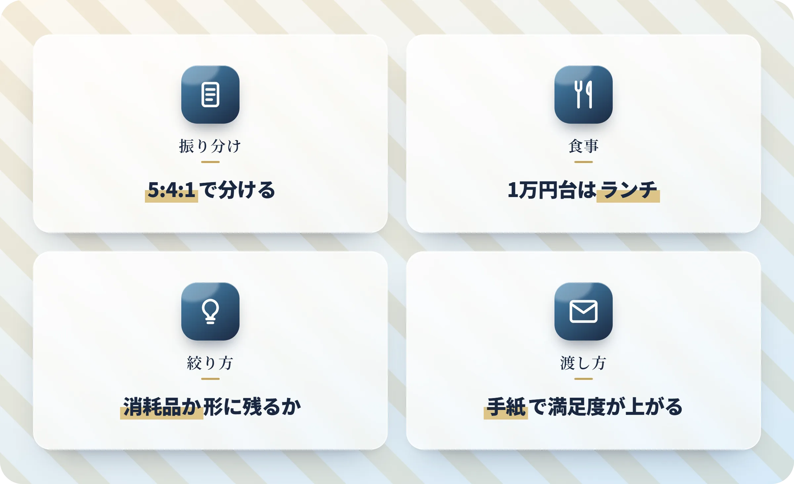

付き合って1年の記念日、プレゼントの相場はいくらなのか。安すぎて軽く見られないか、高すぎて引かれないか、食事代まで入れると総額でいくら飛ぶのか――初めての1年記念日で、この辺りが決まらないまま日だけが近づいている方は多いはずです。

金額で迷うのは、比べる基準をまだ一つも持っていないからです。本記事では相場と調査データのズレ、予算の分け方、金額差の切り出し方を、決める順番に沿って整理しました。まずは金額の全体像から一緒に見ていきましょう。

:::summary
- 付き合って1年の記念日プレゼント相場は1〜3万円が中心
- 実際の調査で最も多いのは5,000〜1万円台
- 予算はプレゼント5・食事4・演出1で総額から割る
- プレート代・個室料・送料で会計は数千円上振れする
- 上限は「来年も同じ額を出せるか」で決める
:::

[[toc]]

## 付き合って1年の記念日プレゼント相場は1〜3万円

相場は1万〜3万円が中心です。ただ、高校生と社会人では出せる額がそもそも違います。

### 高校生・大学生・社会人の年代別プレゼント相場

表は自分に近い行だけ見れば大丈夫です。学生のうちは3,000円台からでも十分に成立します。

| 立場・年代 | プレゼント予算の中心帯 |
|---|---|
| 高校生 | 3,000〜5,000円 |
| 大学生 | 5,000〜1万5,000円 |
| 社会人（20代） | ==1万〜3万円== |
| 30代以上 | 1万5,000〜5万円 |

:::info
この金額は、複数のギフト情報サイトが揃って示している数字です。ただしどのサイトも、根拠になった調査を明示していません。
:::

### 5,000円・1万円・3万円で買えるプレゼント

金額だけ言われても、それで何が買えるのか見えないと決めきれません。1年目に選ばれやすいものを、価格帯ごとに並べました。

- **5,000円前後**：ハンドクリームや香水のミニサイズ、ペアのマグカップ、写真アルバム
- **1万円前後**：シルバーのアクセサリー、キーケースやカードケース、名入れのグラス
- **2〜3万円**：ブランドの財布、腕時計、革小物、ペアリング

1年目は「毎日使えて、値段が透けにくいもの」が外れにくいです。

### 交際年数で見ると1年目はどのあたりか

半年、1年、2〜3年と並べてみると、自分の位置がつかみやすくなります。

- 半年：5,000〜1万円
- 1年：1万〜3万円
- 2〜3年：2〜5万円

この並びを示しているのは1つのギフトサイトだけです。金額の上がり方のイメージとして見ておく程度がちょうどいいところです。

## 相場1〜3万円は高すぎ？調査データが示す実際の予算

1〜3万円と聞いて高いと感じたなら、実際の調査を先に見ておくと落ち着きます。

### 恋人への誕生日ギフトは5,000〜7,000円台が最多

[電通プロモーションプラス](https://note.com/promotionplusb/n/nf4af455637f7)が2025年4月に公開した調査があります。15〜34歳481人に、恋人・パートナーへの誕生日ギフト予算を聞いたものです。最も多かったのは==p:5,000〜7,000円未満==でした。

- 5,000〜7,000円未満：18.6%
- 1万〜2万円未満：17.1%
- 3,000〜5,000円未満：16.4%

:::warning
この調査が聞いているのは誕生日ギフトで、付き合って1年の記念日ではありません。近い場面の参考として見ています。
:::

### クリスマスの20代予算も1万円未満が中心

もう一つ、20代のクリスマス予算を聞いた調査もあります。マネコミ！（東京海上日動あんしん生命）が2025年12月に公開したものです。

- 男性：5,000〜1万円未満が21.4%
- 女性：3,000〜5,000円未満が23.8%

回答は約200人と小さめの調査です。傾向として押さえておく程度で足ります。

### 相場と調査データがずれる理由

2つの調査に共通するのは、中心が5,000〜1万円台に来ることです。ギフトサイトの1〜3万円より、ひと回り低い位置に中心があります。

差が出るのは、そのサイトで扱う商品の価格帯に相場が引っ張られるからだと考えられます。高価格帯の商品を並べているサイトほど、相場も高く出ます。

相場に届かなかったからといって、軽く見られたことにはなりません。

## 記念日の予算はプレゼント・食事・演出の3つに分ける

金額が決まっても、次は「で、何に使うか」で止まります。

### 総額別にプレゼント・食事・演出へ振り分ける

プレゼント単体で考えるのをやめて、==g:総額をプレゼント5・食事4・演出1で割る==と決めやすくなります。

| その日の総額 | プレゼント | 食事 | 演出（プレート・花） |
|---|---|---|---|
| 1万円 | 5,000円 | 4,000円（ランチ2人分） | 1,000円（メッセージプレート） |
| 2万円 | 1万円 | 8,000円（ディナー2人分） | 2,000円（プレート＋小さな花） |
| 3万円 | 1万5,000円 | 1万2,000円 | 3,000円（花束） |

演出欄の金額は、プレート700〜4,000円・花束3,000〜5,000円（片手サイズ）という実費から置いています。総額1万5,000円なら7,500円・6,000円・1,500円です。

### 1年記念日は何する？予算別の食事の決め方

1年目に多いのは、外食にプレゼントを添える形です。食事を張り込むほどプレゼントの枠は減ります。どちらを主役にするか、先に決めておきましょう。

- **1万円台**：ランチにする。同じ店でも夜の6〜7割で収まる
- **2万円台**：ディナーのコース。1人8,000〜1万円が中心
- **3万円台**：ホテルの記念日プラン。[ホテル椿山荘東京](https://hotel-chinzanso-tokyo.jp/restaurant/plan/mokushundo_anniversary/)のアニバーサリープランは1人2万1,000円（税・サービス料込／2026年8月時点）。乾杯ドリンクとミニブーケ付き

予約は2週間〜1か月前に入れておきます。

### 決まらないときのプレゼントの絞り方

さきほどの調査では、ギフト選びの悩みの順位も出ています。1位は「相手の欲しいもの・好みが分からない」で38.8%でした。決まらないのは、あなただけではありません。

:::box color=#3498db label="決まらないときの絞り込み方"
- **消耗品か形に残るものか**を先に決める。ここで候補が半分になる
- **相手が毎日使っているもの**を思い出してみてください。財布・キーケース・イヤホンケースは買い替え時期が来ている確率が高い
- **サイズや細かい好みが要るもの**（服・指輪）は、1年目だと外しやすい
:::

### 渡すタイミングと手紙で特別感を足す

お金をかけずに満足度を上げられるのは、渡し方と手紙の2つです。

:::box color=#1a2840 label="お金をかけずに特別感を足す2つ"
- **渡すタイミング**：食事の終盤にデザートと一緒が定番。当日の朝に渡せば、一日中身につけて過ごしてもらえる
- **手紙**：宛名のある言葉は「自分のために時間を使ってくれた」という手間の証明になる。金額とは別の軸で満足度が上がる。便箋1枚でも足りる
:::

手紙は必須ではありません。ただ、予算を削った年ほど効いてきます。

## 1年記念日で見落としやすい隠れコストと追加料金

見落としても当然の項目ばかりです。相場どおりに組んでも、会計は数千円ふくらむことがあります。

### 会計が上振れする5つの項目と金額

金額が動きやすいのは次の5つです。予約を入れる前にざっと見ておくと、当日の想定外が減ります。

| 項目 | かかる金額・日数 | 気をつけたい点 |
|---|---|---|
| メッセージプレート | 700〜4,000円（税抜） | 前日までの予約が必要な店が多い |
| 個室料 | コース代と別途 | 記念日プランでも別料金のことがある |
| サービス料・消費税 | 店により加算 | 表示価格と支払額が変わる |
| 名入れ・刻印・ラッピング | 数百〜数千円 | ネット注文で後から乗る |
| 送料・制作日数 | 数日〜2週間 | 記念日に間に合わないことがある |

### 予約とメッセージプレートには締切がある

当日でも頼めそうに思えますが、締切を設けている店がほとんどです。ここが一番の取りこぼしどころです。

:::warning
レストランのメッセージプレートは前日14時〜23時で締め切る店が多く、当日の依頼は受けられないことがあります。ホテル椿山荘東京のアニバーサリープランも、予約は利用日の3日前14時までです。
:::

人気店の記念日利用は2週間〜1か月前で埋まります。==p:プレートの相談は予約と同じタイミング==で伝えておくのが確実です。

### ネット注文は送料より納期に注意

名入れや刻印を頼むと、値段より先に納期のほうが問題になります。

- **名入れ・刻印**：制作に数日〜2週間かかる商品がある
- **ラッピング・メッセージカード**：数百〜数千円が後から乗る

注文は記念日の2週間前までに済ませておくと、納期で慌てずに済みます。

## 彼氏・彼女との金額差が気まずいときのすり合わせ方

言い出しにくい話です。ただ、高いものを贈れば喜ばれるとは限りません。

### 金額差が気まずくなるのは返報性が働くから

高いほうを贈ったのに、空気が重くなることがあります。人には、受け取ったものと同じくらいを返したくなる心理があります。社会心理学で==返報性==と呼ばれるものです。

金額が離れると、もらった側には「同じだけ返せていない」という負い目が残ります。喜ばせるつもりの上乗せが、相手の宿題になってしまうこともあります。

### 金額の話を切り出す時期と言い方

先に上限だけ揃えておけば、この気まずさは避けられます。切り出す場所さえ選べば、そこまで重い話にはなりません。

:::box color=#1a2840 label="金額の話を切り出す言い方"
- **時期**：店の予約を入れる前。記念日の1か月前を目安に
- **入り方**：金額だけを単体で切り出すと重くなる。「当日どうする？」の相談の流れに乗せる
- **言い方**：「お互い1万円までにしとかない？そのぶんご飯にかけたいし」
- **サプライズを崩したくないとき**：中身は伏せて、総額のイメージだけ合わせておく
:::

### 相手が高いものを贈ってきたときの対応

すり合わせが間に合わないこともあります。当日、相手のほうが明らかに高かったときの話です。

その場で金額の話はしないほうが穏やかです。現金や追加の品でその日のうちに埋め合わせようとすると、かえって値段の話が前に出てしまいます。

次の誕生日やクリスマスで自然に返す形にしておけば足ります。

## 1年記念日の予算は来年も続けられる額で決める

ここまで決まれば、あとは上限だけです。1年目の金額は、そのまま来年の基準になります。

### 上限は「来年も同じ額を出せるか」で決める

今年だけ張り込むのは簡単です。ただ今年3万円を出して来年2万円に落とすと、「去年より少ない」は相手にも伝わってしまいます。

:::box color=#3498db label="上限を決めるときの2つの質問"
- 来年も同じ額を出せるか。学生なら就職、社会人なら引っ越しや転職で家計は動く
- 相手も同じ額を返せるか。返礼のプレッシャーは、金額差だけでなく絶対額でも生まれる
:::

相場に合わせるより、==g:来年も同じ額を出せるか==で上限を決めるほうが長く続きます。

### プレゼントなしという選択肢もある

「1年記念日にプレゼントは必要なのか」で迷っているなら、なしという形も普通にありです。

- モノが増えるのを好まない相手なら、予算を食事や体験に全部回す形が合う
- 買わない＝手を抜いた、ではない。何にお金を使うかを相手に合わせただけ
- ただし相手が「何かもらえる」と思っていると食い違う。事前のすり合わせとセットで考える

### 物欲がない相手には予算の行き先を変える

物欲がない相手だと、探せば探すほど決まらなくなります。モノではなく、予算の行き先を変えてみましょう。

- **食べ物・お酒**：残らないので、相手の負担になりにくい
- **体験**：日帰り温泉、アクティビティ、ライブのチケット
- **消耗品の格上げ**：毎日使っているシャンプーやコーヒーの上位版

モノが残らない分、その日の写真を撮っておくと1年目の記録になります。

## まとめ｜付き合って1年の記念日プレゼント相場は総額で決める

付き合って1年の記念日プレゼント相場は1〜3万円とされますが、実際の調査の中心は5,000〜1万円台でした。金額はプレゼント単体ではなく、==その日の総額==から決めると組み立てやすくなります。

:::box color=#1a2840 label="この記事の要点"
- 相場1〜3万円はギフトサイトが示す数字で、根拠となる調査は示されていない
- 実際の調査の最多帯は5,000〜1万円台。相場に届かなくても軽く見られない
- 予算はプレゼント5・食事4・演出1で、総額から割り振る
- プレート代・個室料・送料・刻印料で会計は数千円上振れする
- 上限は「来年も同じ額を出せるか」で決める
:::

まずは総額の上限を1つ決めて、5・4・1で割り振ってみてください。金額の話は予約が動き出す前、記念日の1か月前を目安に済ませておくと安心です。

本記事は2026年8月時点の情報です。プレート代・個室料・予約の締切は店舗ごとに違います。予約のときに各店の公式サイトで確認しておくと確実です。
