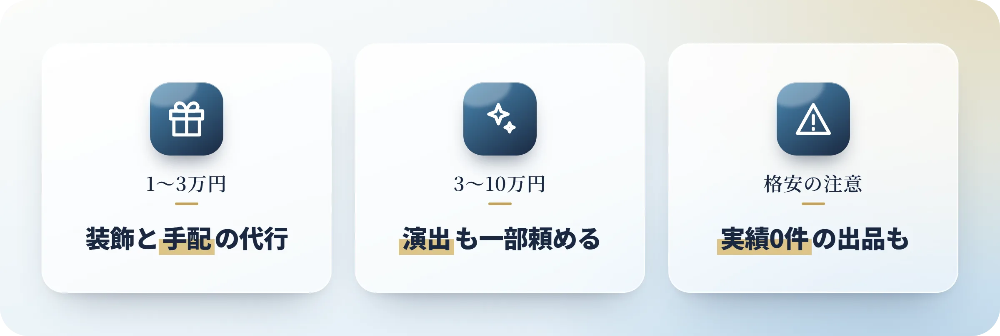
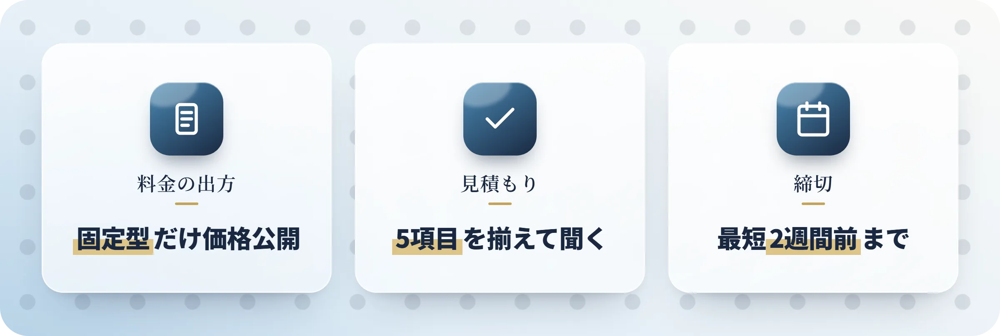

記念日の準備を人に頼みたいけれど、記念日代行の料金相場が分からない、検索すると20万円台の演出プランばかり出てくる、自分の予算で頼める範囲はあるのか――こうした疑問を抱える方は多いのではないでしょうか。

仕事や距離の事情で手が回らないまま当日が近づくのは、よくあることです。準備の一部だけ人に頼むのも、後ろめたく思うようなことではありません。この記事では、記念日代行を依頼内容で4タイプに分けて、それぞれいくらかかるのか、見積もりで何を確認すればいいのかを整理しました。

:::summary
- 記念日代行は4タイプ。料金は1,000円台から40万円台まで開く
- 総額は基本料＋人件費＋実費＋交通費。税込か交通費込みかを揃えて比べる
- 1万〜3万円は装飾やギフト選び、5万円台なら演者1名の演出も頼める
- 会場の公式オプションは無料〜1万9,000円。代行より安く済む項目がある
- キャンセル料は7日前から100%の例がある。契約前に書面で確認する
:::

[[toc]]

## 記念日代行の料金相場｜依頼内容別4タイプ

相場を調べても数字がばらけるのは、記念日代行が4つの違う頼み方をひとまとめにした言葉だからです。料金は1,000円台から40万円台まで開くので、まず自分が何を任せたいのかを決めるところからです。

[画像：記念日代行の依頼タイプ別 料金相場の一覧図 | alt: 記念日代行の料金相場を依頼内容別4タイプで比較した表]

| タイプ | 頼めること | 料金の幅 | 向いている人 |
|---|---|---|---|
| 演出代行 | フラッシュモブなどの演者手配・構成・当日進行 | 9万〜40万円台 | 大人数の演出をやりたい |
| 装飾代行 | ホテルの部屋や会場のバルーン・花の飾り付け | 8,000〜8万8,000円 | 部屋を丸ごと飾りたい |
| 選定・購入・予約の代行 | ギフト選び、店の予約、手配の肩代わり | 1,000円台〜＋実費 | 何を選ぶかで詰まっている |
| トータルプロデュース | 企画から当日の進行まで丸ごと | 要見積もり | 何から手をつけるか分からない |

金額が跳ね上がるのは、4つのうち演出代行だけ。装飾やギフト選びの代行なら、==1万円あれば頼める内容==もあります。

## 代行料金の内訳は基本料・人件費・実費・交通費

同じ内容を頼んでも、見積書の金額は会社によってかなり開きます。どこまでを表示価格に含めるかが違うからです。総額は基本料＋人件費（人数×単価）＋実費＋交通費に分かれ、[エモーションライズ](http://emotionrise.jp/fee.html)はこの内訳をそのまま公開しています。

:::box color=#3498db label="料金の分解例（エモーションライズ／税込）"
- 基本セット 5万5,000円：打ち合わせ・下見・構成・2時間のレッスン込み。何人頼んでも同じ額です
- キャスト 2万2,000円/人（拘束5時間まで）。超過は2時間ごと3,300円/人
- 公式サイトの計算例：大阪市でキャスト8名なら23万1,000円
:::

| 依頼先 | 表示価格 | 税・交通費 |
|---|---|---|
| [フラッシュモブ大阪](https://flashmobosaka.com/price/) | 5名17万9,000円 | 税込・交通費込み |
| [START-LAMP](https://start-lamp.jp/flashmob/) | サプライズ演出16万円 | 税別・交通費別 |
| [サプライズモール](https://surprise-mall.jp/price/) | メモリプレイ ライト23万9,800円 | 税込・交通費3万円〜別 |

税別16万円は税込17万6,000円、ここに交通費も乗ります。安く見える見積書ほど、==税込か・交通費込みか==を先に揃えてから並べ直したいところです。

## 予算1万〜10万円で頼める記念日代行の選択肢

15万円は出せない、という前提で探している方も多いはずです。予算帯ごとに見ていきましょう。

### 1万〜3万円：装飾・ギフト選び・予約の代行

この価格帯で頼めるのは、飾りつけと「選ぶ・手配する」の肩代わりです。頼む先が専門店か個人の出品かで、任せられる範囲は変わります。

[画像：1万〜3万円で頼める記念日代行の料金一覧図 | alt: 記念日代行を1万〜3万円で頼んだ場合の内容と料金の一覧]

| 内容 | 料金 | 頼める先の例 |
|---|---|---|
| ホテル客室のバルーン装飾 | 1万6,500円〜（税込） | [Loved up balloons](https://lovedup-balloons.com/hotel/) H1プラン |
| バルーン装飾（東京・横浜） | 8,000円〜 | [アニプラバルーン](https://anipla-balloon.jp/) |
| ギフト選びの代行 | 1,000円〜（税込） | ココナラの出品 |
| 予約・手配の代行 | 2,000円〜 | ロコタビ（東京） |

### 3万〜10万円：装飾のグレードと演出の一部依頼

5万円前後まで出せるなら、選べる中身が一段増えます。演出も、一部だけなら手が届きます。

[画像：3万〜10万円で頼める記念日代行の料金一覧図 | alt: 記念日代行を3万〜10万円で頼んだ場合の内容と料金の一覧]

- 部屋全体のバルーン装飾：Loved up balloonsのH3・H4プランが6万3,800円（税込）
- 演者を1人だけ頼む：エモーションライズは基本セット5万5,000円＋キャスト1名で7万7,000円
- 構成とレクチャーだけ頼む：START-LAMPが8万円（税別）。踊るのは自分たちや友人

3つに共通するのは、丸ごと任せずに自分たちがやる部分を残している点です。

### 1,000円台の出品で気をつけたい点

1,000円台の出品を選ぶなら、申し込む前に確かめておきたいことがあります。

:::box color=#e74c3c label="安い出品を選ぶ前に見ておきたいこと"
- 2026年8月に記念日関連の出品を3件見たところ、1件は削除済み、1件は受付休止中、1件は==販売実績0件==でした
- [くらしのマーケット](https://curama.jp/balloon-decoration/)の出張バルーン装飾は、表示の相場が8,000〜2万円。実際の出品は2万7,500〜8万8,000円でした
- 「ギフト選びだけ」「予約だけ」なら十分使えます。当日の進行まで任せるなら、別の依頼先を探したほうが安心です
:::

## 代行の前に見たいホテル・レストランの公式オプション

代行を探しているときに抜けやすいのが、会場そのものが受けてくれる範囲です。飾りつけやケーキなら、[三井ガーデンホテル銀座プレミア](https://www.gardenhotels.co.jp/ginza-premier/anniversary/)のように料金と申込期限まで公開している会場があります。

| オプション | 料金（税込） | 申込期限 |
|---|---|---|
| TVメッセージ表示・プチギフト | 無料 | 前日まで |
| ホールケーキ（φ10cm） | 3,300円 | 3日前18時まで |
| フルーツプレート | 3,300円 | 3日前18時まで |
| スパークリングワイン（ハーフ375ml） | 3,300円 | 3日前18時まで |
| バルーンボックス | 8,800円 | 5日前18時まで |
| フラワーボックス | 1万9,000円 | 8日前18時まで |

:::box color=#3498db label="会場のオプションでは埋まらない部分"
- 何をどう組み合わせるかを決めること
- 会場・花・ケーキ・撮影と散らばる手配をまとめること
- 当日の進行（渡すタイミング、合図、スタッフとの段取り）
:::

外部に頼むバルーン装飾は1万6,500円からですが、==ホテル公式のバルーンボックスは8,800円==です。会場で頼めるものは会場に、埋まらない部分だけ人に頼む――手抜きではなく、力の入れどころを決めているだけです。

## 料金非公開のサービスが多い理由と見積もりの取り方

料金非公開と書かれていると、それだけで身構えてしまいます。まず理由から。

### プラン固定型とオーダーメイド型で料金の出方が違う

2026年8月時点で調べたところ、料金を載せる会社と載せない会社は売り方で分かれました。

- **プラン固定型**：フラッシュモブ各社・バルーン装飾各社・サプライズモールはサイトに価格を掲載しています
- **オーダーメイド型**：[記念日屋さん](https://kinenbiyasan.jp/)・[カラフル株式会社](https://color-full.net/anniversary/)・[アウテック](https://www.outech.co.jp/service/surprise.html)・[アットサプライズジャパン](https://atsurprise.jp/)は==4社とも料金非公開==です

金額を隠しているわけではなく、内容が一件ごとに変わるので先に数字を出せないだけです。Annivも都度組み立てるため、固定価格は置いていません。

### 見積もりで必ず確認したい5項目

見積書を並べても、条件が揃っていなければ比べようがありません。聞いておきたいのは次の5つです。

1. 税込か税別か
2. 交通費・出張費は込みか別か
3. 撮影は含まれるか、別料金か
4. 花・ケーキ・店の代金などの実費は誰が払うのか
5. キャンセル規定は何日前から何%か

日付と場所、予算、相手との関係性をメモにしてから送ると、返信が早く戻ってきます。届いた金額を見てから断っても構いません。

### 依頼の締切は最短2週間前から

記念日は日付を動かせません。締切は先に押さえておきたいところです。

- 演出代行：最短2週間でも対応できると[サプライズモールの依頼の流れ](https://surprise-mall.jp/flow/)に明記されています
- バルーン装飾：1〜2週間前の申し込みが推奨。3日前まで変更でき、前日から当日のキャンセルは100%です
- 会場の記念日オプション：前日から8日前まで、オプションごとに違います

日が近づくほど、選べる中身は減っていきます。まだ迷っている段階でも、日付だけ伝えて空きを聞いておくと候補が残せます。

:::box label="無料相談・お問い合わせ"
記念日の準備をまるごと任せたいなら、[お問い合わせフォーム](https://anniv.gift/contact)から無料でご相談いただけます。予算や希望が固まっていない段階のご相談も受け付けています。
:::

## 追加費用とキャンセル料｜契約前に確認したい点

見積書の合計額が、そのまま支払う総額になるとは限りません。動くのは追加費用とキャンセル料の2つで、どちらも契約の前に確かめられます。

| 追加されやすい項目 | 金額 | 例 |
|---|---|---|
| 撮影オプション | ＋14万3,000円（税込） | サプライズモール |
| ピンマイク | ＋4万4,000円（税込） | サプライズモール |
| 超過料金 | 2時間ごと3,300円/人（税込） | エモーションライズ |
| 東京エリア加算 | 3,300円/人（税込） | エモーションライズ |
| 繁忙期加算（12/20〜12/25） | ＋8,800円 | アニプラバルーン |
| 花・ケーキ・店の代金 | 実費が別にかかる | 各社共通 |

| キャンセルのタイミング | サプライズモールの規定 |
|---|---|
| 2か月以上前 | 2万2,000円 |
| 2か月前〜1か月前 | 演出プラン金額の20% |
| 30日前〜8日前 | 50% |
| 7日前〜当日 | ==100%== |
| 台本の打ち合わせ後 | 期間に関わらず20% |

キャンセル規定を出していない会社もあるので、申し込み前に書面でもらっておくと安心です。法律事務所の解説では、平均的な損害を超える違約金は無効とされています（消費者契約法9条）。

## まとめ｜記念日代行の料金相場はタイプで決まる

記念日代行の料金は、頼む内容のタイプで桁が変わります。==自分が任せたいのがどのタイプか==が決まれば、見る必要のない価格帯は最初から外せます。

:::box color=#1a2840 label="この記事の要点"
- 記念日代行は4タイプ。演出代行は9万〜40万円台、装飾・選定の代行は1,000円〜8万円台
- 総額は基本料＋人件費＋実費＋交通費。税別表示は消費税と交通費が後から乗る
- 予算5万円台なら演者1名の演出、6万円台なら部屋全体の装飾も頼める
- 会場の公式オプションはTVメッセージが無料、バルーンボックスが8,800円
- キャンセル料は7日前から100%の例あり。規定は申し込み前に書面で確認する
:::

まずは日付と場所、予算の3つだけ決めて、同じ条件で2〜3社に見積もりを頼んでみてください。届いた金額を同じ条件に直して並べれば、自分の予算で何がどこまで頼めるのかが見えてきます。

本記事は2026年8月時点の情報です。料金は各社の公式サイトで最新の内容を確認してください。
